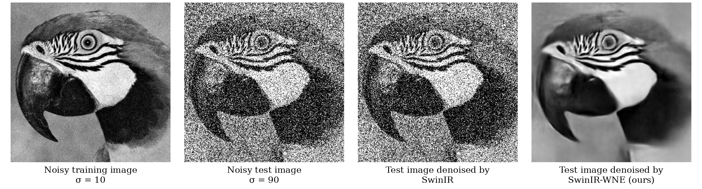
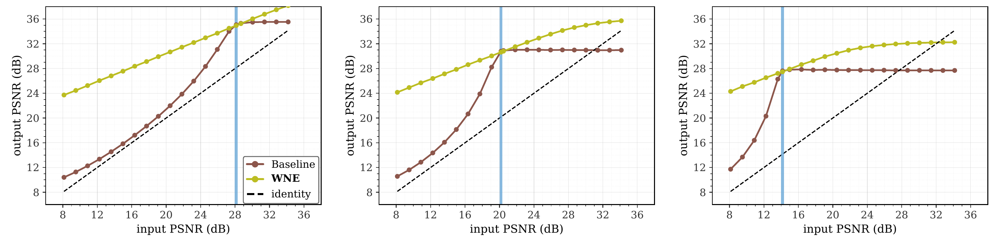
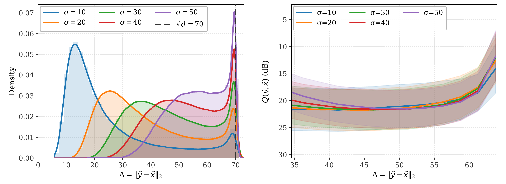
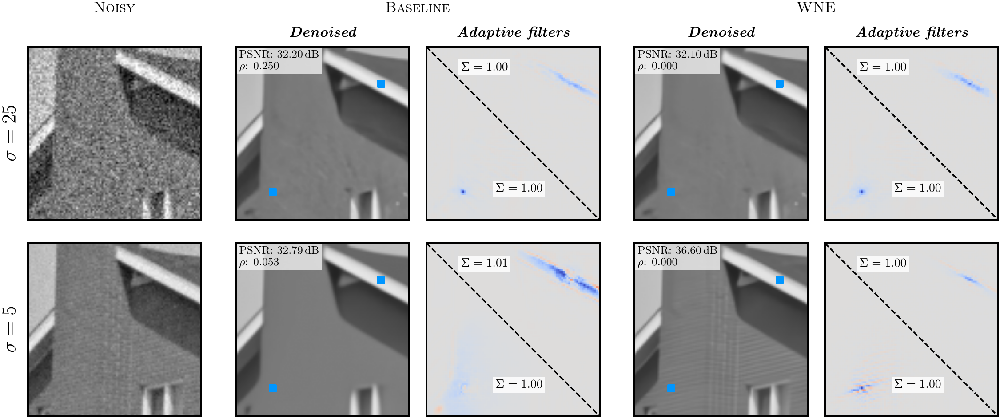

# Normalization Equivariance for Arbitrary Backbones, with Application to Image Denoising

Exact normalization equivariance for CNN and transformer denoisers, without changing their internals.

[arXiv](https://arxiv.org/abs/2605.08193) · [BibTeX](#citation)



SwinIR qualitative denoising under noise-level mismatch. Both models are trained at `sigma=10` and evaluated at `sigma=90`; the unwrapped SwinIR degrades under the shift, while SwinIR-WNE remains stable.

## TL;DR

WNE wraps any denoiser with a normalize / process / denormalize parameterization that enforces exact normalization equivariance. We prove this is an if-and-only-if characterization of normalization-equivariant maps, then use it to make CNNs and transformers robust to noise-level mismatch with no measurable GPU overhead.

## Core Idea

```python
from se.models.wrappers import NormEquivariant

backbone = make_backbone(...)
model = NormEquivariant(backbone, pred_mode="direct")
```

The wrapper computes a global mean and standard deviation per input, normalizes the input, runs the backbone, then rescales and recenters the output.

## Results

### Inpainting Sampler


Same SwinIR backbone, trained at `sigma=10` on Noise2Noise pairs, dropped into a [Kadkhodaie-Simoncelli](https://proceedings.neurips.cc/paper_files/paper/2021/hash/6e28943943dbed3c7f82fc05f269947a-Abstract.html) random-inpainting sampler. On Set12 with 10% observed pixels and the sampler initialized at `initial_sigma_8bit=255`, the baseline collapses at 6.08 dB while WNE recovers cleanly at 23.87 dB.

| Method | Final PSNR | SSIM | Drop from peak |
| --- | ---: | ---: | ---: |
| Baseline-N2N | 6.08 dB | 0.009 | 0.91 dB |
| WNE-N2N | 23.87 dB | 0.716 | 0.00 dB |

`Drop from peak` is the best trajectory PSNR minus final PSNR; lower means the sampler did not peak early and then degrade. GIF details: Set12 image 07, keep fraction 0.1, seed 0; checkpoints `wne_swinir_10_n2n` and `b_swinir_10_n2n`.

### Mismatch Curves



SwinIR output PSNR versus input PSNR on Set12 for single-noise training at `sigma_train=10`, `25`, and `50` from left to right. WNE stabilizes performance away from the training noise level, while the unwrapped baseline is noise-level specific. Vector PDFs: [10](artifacts/figures/denoising/swinir_sigma10.pdf), [25](artifacts/figures/denoising/swinir_sigma25.pdf), [50](artifacts/figures/denoising/swinir_sigma50.pdf).

### Why It Works

WNE aligns inputs into normalized coordinates, where residual error is largely organized by a single difficulty parameter.



Normalized-coordinate analysis. Left: the train/test distribution of normalized difficulty `Delta` shifts with the noise level. Right: for WNE at `sigma_train=50`, normalized residual error is mostly organized by `Delta`, explaining why the wrapper extrapolates smoothly across noise levels. Vector PDFs: [Delta histogram](artifacts/figures/mechanism/delta_histogram.pdf), [WNE residual curve](artifacts/figures/mechanism/wne50_delta_vs_norm_residual_95pct.pdf).



Input-adaptive Jacobian filters for SwinIR. Under mismatch, WNE preserves structured, edge-aligned filters and improves PSNR while retaining the same transformer backbone.

## Setup

```bash
uv sync
```

Use `uv run ...` for all commands below. The project installs the local `se/` package.

## Evaluation Examples

The commands in this section require the corresponding checkpoint weights under `logs/<model_key>/weights_last.pt`.

Main SwinIR mismatch curve at `sigma_train=10`:

```bash
uv run python -c "from eval import main, EvalConfig; main(EvalConfig(model_keys=['b_swinir_10','wne_swinir_10'], save_name='swinir_sigma10.pdf', n_averages=20, include_train_sigma_in_grid=True))"
```

Main DnCNN-family mismatch curve at `sigma_train=10`:

```bash
uv run python -c "from eval import main, EvalConfig; main(EvalConfig(model_keys=['b_dncnn_10','se_fdncnn_10','ne_fdncnn_10','wne_dncnn_10'], save_name='dncnn_sigma10.pdf', n_averages=20, include_train_sigma_in_grid=True))"
```

SSIM and NE-defect controls:

```bash
uv run python eval_ssim.py
uv run python eval_ne_violation.py
```

Kadkhodaie-Simoncelli-style random inpainting sampler with the WNE-N2N checkpoint:

```bash
uv run python -c "from denoiser_sampler import main, SamplerConfig; main(SamplerConfig(model_key='wne_swinir_10_n2n', problem='random_missing', random_keep_fraction=0.1, initial_sigma_8bit=255, sigma_stop_8bit=2.55))"
```

Outputs are written under `eval_logs/` or `artifacts/`.

## Training

The default training entry point runs `cfg_50_dncnn_wne`:

```bash
uv run python train.py
```

For another paper config, import it from `experiments_cfg.py` and pass it to `train.main`, for example:

```bash
uv run python -c "from train import main; from experiments_cfg import cfg_10_swinir_wne; main(cfg_10_swinir_wne)"
```

Training data should be under `data/` with the folder names used in `experiments_cfg.py`.

## What Is Included

- `se/`: DnCNN, FDnCNN, SwinIR, Restormer, wrappers, metrics, noise models, and plotting utilities.
- `train.py`, `experiments_cfg.py`: supervised, Noise2Noise, Soft-NE, non-Gaussian, Restormer, and color configs used in the paper.
- `eval.py`, `eval_ssim.py`, `eval_ne_violation.py`: PSNR, SSIM, and explicit NE-defect sweeps.
- `analysis/`: normalized-coordinate analysis scripts for difficulty/residual plots.
- `denoiser_sampler.py`: Appendix N sampler for iterative denoising and linear inverse problems.
- `data/Set12`, `data/Set68`: small BSD-derived test sets for quick evaluation.
- `logs/`: checkpoint configuration directories. Model weights are not bundled in the Git repo.

Training datasets and pretrained checkpoints are not bundled. Place BSD400 under `data/BSD400` for the default training configs. Use `uv run python data/download_datasets.py` for Waterloo, DIV2K, Flickr2K, and SIDD; place CBSD68 under `data/CBSD68` for color Restormer evaluation.

For checkpoint-based evaluation, place each `weights_last.pt` under the corresponding `logs/<model_key>/` directory listed in `model_logs.py`, or train the models locally first.

## License

Code: [MIT License](LICENSE).

## Citation

```bibtex
@inproceedings{saied2026normalization,
  title = {Normalization Equivariance for Arbitrary Backbones, with Application to Image Denoising},
  author = {Saied, Youssef and Fleuret, Fran{\c{c}}ois},
  booktitle = {Proceedings of the 43rd International Conference on Machine Learning},
  series = {Proceedings of Machine Learning Research},
  volume = {306},
  year = {2026},
  publisher = {PMLR}
}
```
